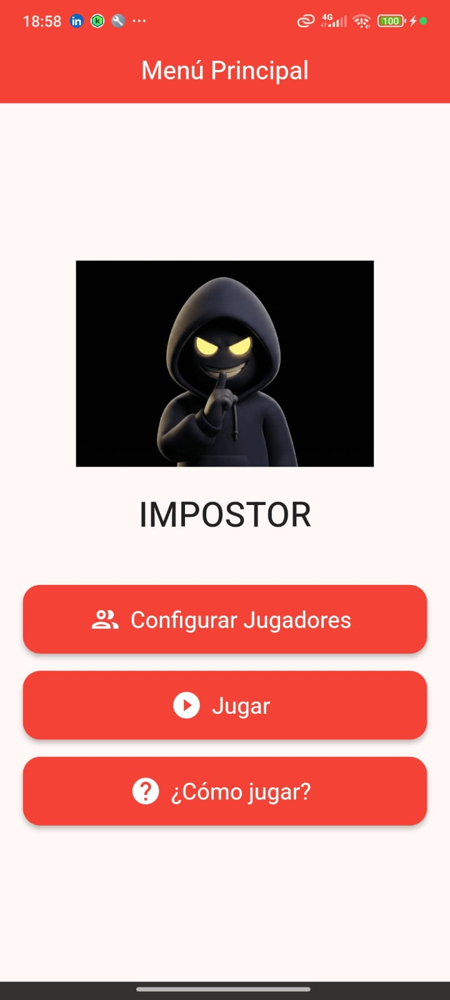
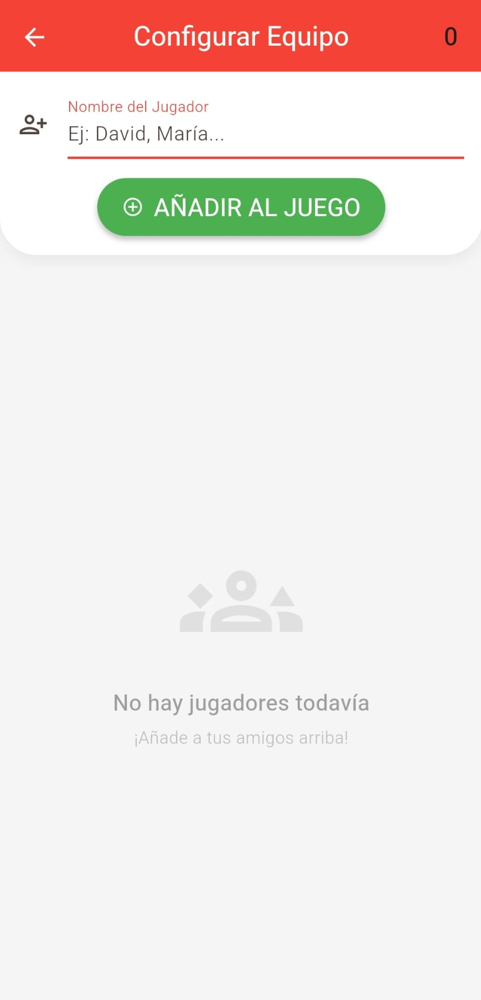
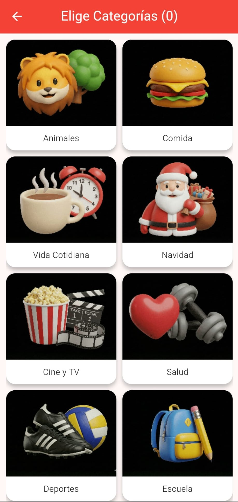

# 🕵️‍♂️ El Impostor

> **¿Quién miente? ¿Quién dice la verdad? Descúbrelo antes de que sea demasiado tarde.**

**El Impostor** es un juego social de deducción para jugar en grupo (local multiplayer). Inspirado en mecánicas clásicas como "Spyfall", el objetivo es descubrir quién de los jugadores no conoce la palabra secreta mientras todos intentan disimular.

---

## 📱 Capturas de Pantalla

| Menú Principal | Gestión de Jugadores | Selección de Categorías |
|:---:|:---:|:---:|
|  |  |  |

---

## 🚀 Características Principales

* **👥 Gestión Dinámica de Equipos:** Añade y elimina jugadores fácilmente con una interfaz intuitiva. Soporte para avatares generados por iniciales.
* **🎨 Múltiples Categorías:** Más de 20 temas disponibles (Deportes, Cine, Navidad, Tecnología...) con ilustraciones estilo 3D personalizadas.
* **🔀 Modo Mix:** ¡Juega con múltiples categorías a la vez! Selecciona varios temas y el juego elegirá una palabra al azar de entre todos ellos para aumentar la dificultad.
* **🧠 Lógica de Juego:** Asignación aleatoria de roles (Ciudadanos vs Impostor) y palabras secretas.
* **🎨 Diseño Visual:** Interfaz moderna basada en **Material 3**, con una paleta de colores vibrante (Rojo/Verde) y animaciones fluidas.
* **📱 Icono Adaptativo:** Icono de aplicación personalizado y optimizado para Android e iOS.

## 🛠️ Tecnologías Utilizadas

Este proyecto ha sido desarrollado con **Flutter** y **Dart**.

* **Framework:** Flutter (SDK ^3.9.2)
* **Lenguaje:** Dart
* **Gestión de Estado:** `setState` (Enfoque nativo y ligero).
* **Navegación:** Rutas nombradas y gestión de argumentos.
* **Paquetes Clave:**
    * `flutter_launcher_icons`: Generación automática de iconos nativos.
    * `cupertino_icons`: Iconos estilo iOS.
 
---

## 📄 Licencia

Este proyecto está bajo la **Licencia MIT**.

**Puedes usar, modificar y distribuir este código libremente, siempre que se incluya la nota de copyright original.**

Para ver el texto completo de la licencia: [Licencia MIT (en GitHub)](https://github.com/licenses/mit)

---

## 📂 Estructura del Proyecto

El código está organizado siguiendo buenas prácticas de arquitectura limpia:

```text
lib/
├── data/           # Datos estáticos (palabras, categorías) y estado global simple
├── models/         # Modelos de datos (opciones de menú)
├── routes/         # Definición de rutas de navegación
├── screens/        # Pantallas (UI)
│   ├── home_screen.dart
│   ├── jugadores_screen.dart
│   ├── categorias_screen.dart
│   └── roles_screen.dart
├── theme/          # Configuración de estilos y colores (AppTheme)
└── widgets/        # Widgets reutilizables (Tarjetas, Inputs, Botones)
```

## 🏁 Cómo ejecutar el proyecto

Sigue estos pasos para probar la aplicación en tu entorno local:

1. **Clonar el repositorio:**

```bash
git clone [https://github.com/tu-usuario/fl_impostor.git](https://github.com/tu-usuario/fl_impostor.git)](https://github.com/daaviddieeguez/Impostor-Game.git)
```
2. **Instalar dependencias:**
```bash
flutter pub get
```

3. **Generar Iconos (Opcional):** Si cambias la imagen en assets/Impostor-sin-fondo.png, regenera los iconos con:
```bash
dart run flutter_launcher_icons
```
4. **Ejecutar la App:** Conecta tu dispositivo o emulador y corre:
```bash
flutter run
```
---
## ⬇️ Descargar e Instalar (APK)

Si deseas probar la aplicación sin instalar el entorno de desarrollo Flutter, puedes descargar el archivo binario directamente:

1.  Ve a la pestaña **Releases** (Lanzamientos) de este repositorio.
2.  Busca la última versión estable (ej: `v1.0.0`).
3.  Descarga el archivo **`app-release.apk`** y ábrelo en tu dispositivo Android.
---
## 🎮 Cómo Jugar
1. **Configurar Jugadores:** Añade los nombres de todos los participantes (mínimo 2, recomendado 3+).
2. **Elegir Tema:** Selecciona una o varias categorías.
3. **Repartir Roles:** Pasa el móvil a cada jugador. Cada uno verá su carta secreta:
    * **Ciudadanos:** Ven una palabra clave (ej: "Pizza").
    * **El Impostor:** Ve "Eres el Impostor" (no sabe la palabra).
4. **Debate:** Todos hacen preguntas o descripciones sutiles sobre la palabra.
5. **Votación:** Al final del tiempo, votad quién creéis que es el impostor. ¡Si le atrapáis, ganan los ciudadanos!

---

## ✨ Créditos y Contacto

* **Autor del Código:** David Diéguez
* **Generación de Assets:** Las ilustraciones y el logo fueron generados con asistencia de Inteligencia Artificial.
